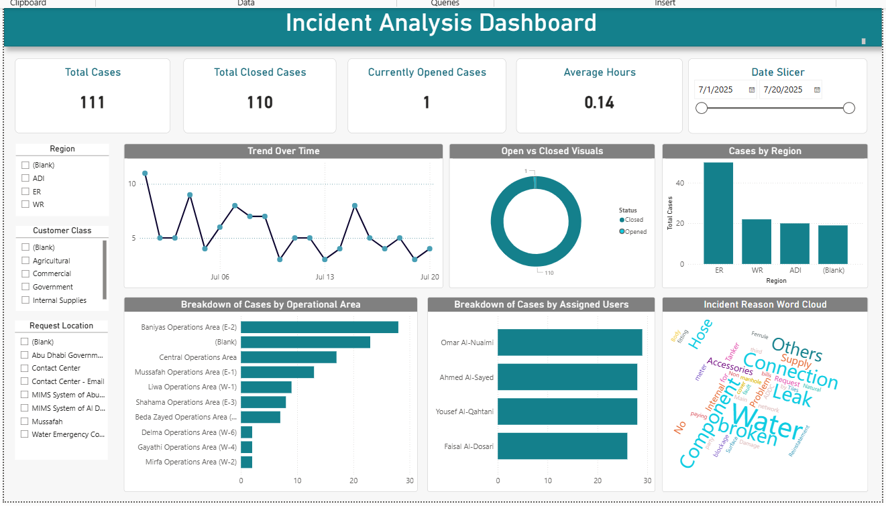

# Case Management & Performance Tracking Dashboard

📌 **Purpose:**  
This Power BI dashboard helps teams monitor, track, and manage cases/requests efficiently by visualizing performance metrics, case status, weekly trends, and personnel workload.

### ⚙️ Features
- Total cases by **Status** (Open, In Progress, Closed, etc.)
- **Request Type** and **Assigned Person** filtering
- **Weekly performance trend** to monitor new and resolved cases
- Visual comparison of **pending vs. completed cases**
- **Distribution charts** to identify bottlenecks

### 🛠️ Tools Used
- Power BI
- DAX
- Power Query
- Excel (for mock data source)

### 📷 Preview

### 📁 Dataset
This project uses mock data to protect sensitive information.

### 📦 Included Files
- Power BI `.pbix` file
- Sample mock dataset (`.xlsx`)
- Dashboard screenshots
- Project documentation

---

> 📊 Designed for internal performance review and case resolution optimization by team leads.  
> 📁 Editable Power BI file included for customization and review.

---

### 🧾 License
MIT License (you can change this if needed)
